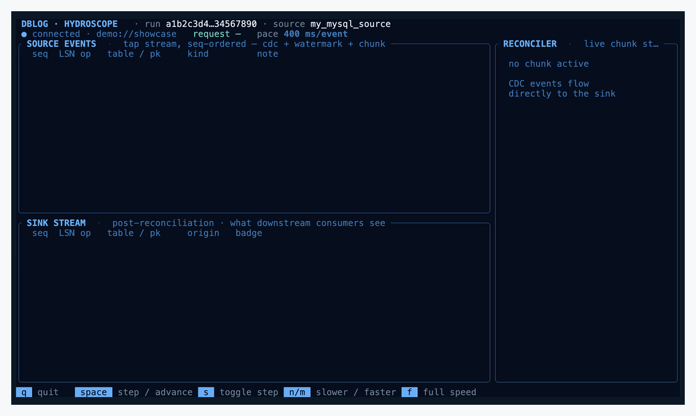
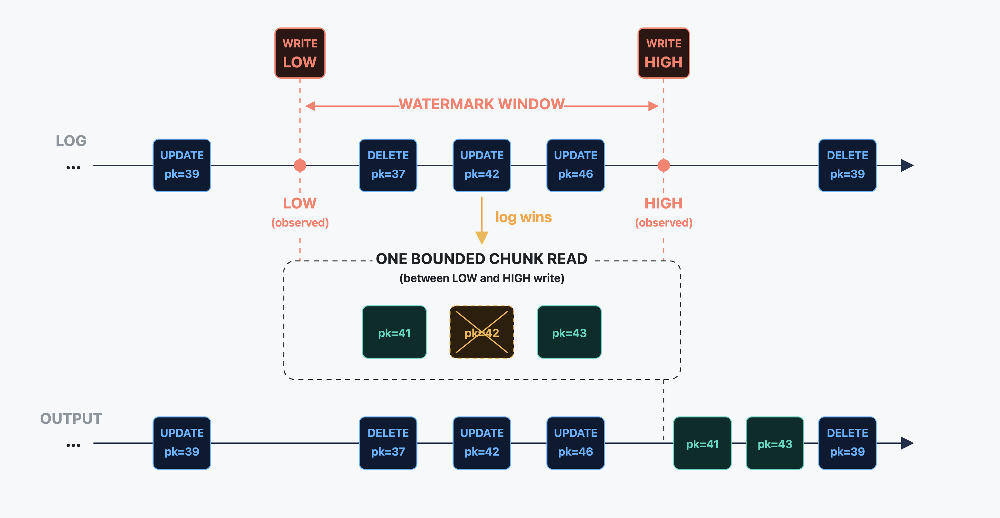

# DBLog: Watermark-Based Change-Data Capture

[](https://github.com/aandreakis/dblog-impl/actions/workflows/ci.yml)
[](LICENSE)
[](https://openjdk.org/projects/jdk/21/)

An implementation of **DBLog**, the watermark-based
change-data-capture algorithm for refreshing table state while transaction-log
capture keeps running.

This repository is published by one of the co-authors of the original DBLog
paper and Netflix Technology Blog post. Its purpose is to make the published
algorithm executable, inspectable, and easy to test from public material, so
readers can study DBLog and understand how the watermark algorithm works.

[](ops/tap-tui/README.md)

*DBLog at work: the watermark algorithm merging transaction-log changes with
bounded chunk reads into one clean ordered stream. Shown in the Hydroscope TUI.*

## Why this exists

DBLog answers a practical CDC question: **how can a system copy table rows in
bounded chunks while live changes continue to arrive from the database log?**

Use this repository to:

- study the DBLog watermark algorithm in code,
- run MySQL/PostgreSQL fixtures end to end,
- audit the paper against executable behavior,
- inspect restart, recovery, and checkpoint behavior,
- use a compact implementation as a teaching or comparison point.

For auditors, [docs/PAPER_MAP.md](docs/PAPER_MAP.md) maps every Algorithm 1
step to code, fail-closed guards, and test locks, and tracks paper deltas
(modernizations and deliberate omissions) explicitly.

This repository is not recommended for production use. For production CDC, use a
maintained system such as [Debezium](https://debezium.io/).

## DBLog in one minute

A chunked snapshot can race with live log events. DBLog makes that race explicit
and deterministic:

1. keep consuming committed source-log transactions.
2. write a **low watermark** row into the source metadata table.
3. read a bounded primary-key chunk.
4. write a **high watermark** row.
5. while the log advances from low to high, pass log events through and remove
   any selected chunk row whose primary key was changed by a fresher log event.
6. when the high watermark appears on the log stream, emit the remaining chunk
   rows and persist completed-chunk progress before acknowledging the source
   checkpoint.

Snapshot rows are provisional. In-window log events are newer and take precedence on collision. For the formal algorithm and motivation, read
the [paper](https://arxiv.org/abs/2010.12597) and the
[Netflix Technology Blog post](https://netflixtechblog.com/dblog-a-generic-change-data-capture-framework-69351fb9099b).
For a paper-to-code audit map, see [docs/PAPER_MAP.md](docs/PAPER_MAP.md).

<p align="center">
  
</p>

<p align="center"><em>In this example the chunk selects pk=41, pk=42, and pk=43. The chunk entry for pk=42 is dropped because an UPDATE event for that key is received in the LOG within the observed LOW–HIGH window. The OUTPUT lane shows the reconciled stream after HIGH: in-window log events plus the surviving chunk rows.</em></p>

## Quick start

Prerequisites:

- Java 21
- Docker, for demos and Docker-backed tests
- Python 3.9+, for `scripts/demo/*.py`
- Rust stable only if you want to build Hydroscope

Run the shortest end-to-end demo:

```bash
python3 scripts/demo/mysql_to_postgres.py
```

On Windows:

```powershell
py -3 scripts/demo/mysql_to_postgres.py
```

The demo starts disposable local fixtures, runs DBLog on the host, submits an
`ALL_TABLES` dump through the local HTTP control plane, verifies the initial
copy, applies live source changes, and verifies convergence again. Logs are
written under `build/demo/<demo-name>/runtime.log`. Isolated demo fixture
containers stop on exit. Set `DBLOG_DEMO_KEEP_CONTAINERS=1` to leave
them running for inspection.

On a cold cache the first run pulls Docker images and can take a few minutes.
Subsequent runs are much faster. On success this demo prints
`Initial dump converged.`, then `Live changes converged.`, and ends with
`Demo succeeded.` on exit 0.

Useful verification commands:

```bash
./gradlew test                  # fast unit tests
./gradlew integrationTest       # adapter and state integration tests
./gradlew integrationTestDocker # Docker-backed adapter integration tests
./gradlew e2eTest               # inspection-mode recovery/drift/failure scenarios
./gradlew e2eTestDocker         # live Docker convergence and repair scenarios
./gradlew compatibilityMatrix   # mysql:8.0/8.4/9.6 and postgres:14-18
```

Wall times vary by hardware and Docker cache state: `test` finishes in well
under a minute, `integrationTest` and `e2eTest` typically run a few minutes,
and the Docker-backed lanes (`integrationTestDocker`, `e2eTestDocker`) are
longer because they spin up real database fixtures. `compatibilityMatrix` is
the slowest by design: it walks the full source-image matrix and can take
20+ minutes.

The fixture credentials are disposable and bind database ports to `127.0.0.1`.
Do not expose them on an untrusted network.

## What ships

| Area | Included |
| --- | --- |
| Runtime | Java 21, Spring Boot, Gradle |
| Sources | MySQL binlog streaming, PostgreSQL `pgoutput` logical replication |
| Source-image matrix | `mysql:8.0`, `mysql:8.4`, `mysql:9.6` / `postgres:14` through `postgres:18` |
| Sinks | NDJSON stream/file, typed H2 inspection sink, JDBC target apply for PostgreSQL/MySQL, explicit no-op |
| State | Embedded H2 checkpoints, schemas, requests, and chunk progress |
| Control plane | Local HTTP API for status, metrics, request submission, and inspection |
| Verification | Unit, integration, Docker-backed e2e, and source-version matrix tests |
| Visualization | Optional Hydroscope Rust TUI over an educational tap stream |

## Reading path

| Start here | Why |
| --- | --- |
| [docs/PAPER_MAP.md](docs/PAPER_MAP.md) | Every Algorithm 1 step mapped to code, fail-closed guards, and test locks, with paper deltas tracked |
| [WindowReconciler.java](src/main/java/io/github/aandreakis/dblog/core/reconcile/WindowReconciler.java) | Low/high watermark state machine and collision handling |
| [DefaultDumpWindowCoordinator.java](src/main/java/io/github/aandreakis/dblog/core/request/DefaultDumpWindowCoordinator.java) | Opens chunk windows and persists restart boundaries |
| [DefaultTargetedRepairCoordinator.java](src/main/java/io/github/aandreakis/dblog/core/request/DefaultTargetedRepairCoordinator.java) | Targeted primary-key repair through the same window machinery |
| [RuntimeRequestPump.java](src/main/java/io/github/aandreakis/dblog/runtime/loop/RuntimeRequestPump.java) | Interleaves live streaming with queued operator requests |
| [docs/OPERATION.md](docs/OPERATION.md) | Configuration, boot modes, sinks, and operational behavior |
| [docs/CONTROL_PLANE.md](docs/CONTROL_PLANE.md) | HTTP API shape and request lifecycle |
| [docs/adapters/mysql.md](docs/adapters/mysql.md) / [docs/adapters/postgres.md](docs/adapters/postgres.md) | Source-specific preconditions and limits |

Coding agents should also read [AGENTS.md](AGENTS.md).

## Run locally

The Python demos are the fastest path:

```bash
python3 scripts/demo/mysql_to_postgres.py
python3 scripts/demo/mysql_to_ndjson.py
python3 scripts/demo/postgres_to_mysql.py
```

If the demos reuse a database stack you started manually with
`docker compose -f ops/docker/compose.yml up -d`, they leave that stack running.
Stop it with `docker compose -f ops/docker/compose.yml down -v`.

To run the runtime manually against the Docker fixtures:

```bash
docker compose -f ops/docker/compose.yml up -d

./gradlew bootRun \
  --args="--spring.config.additional-location=file:./ops/docker/examples/local/mysql-to-postgres/application.properties"
```

With the local control plane enabled:

```bash
curl -sS http://127.0.0.1:8085/api/v1/runtime/status

curl -sS -X POST http://127.0.0.1:8085/api/v1/requests \
  -H 'Content-Type: application/json' \
  -d '{"scope":"ALL_TABLES"}'
```

If `8085` is in use, pass `--dblog.control-plane.port=<port>` to `bootRun` (or set
`DBLOG_CONTROL_PLANE_PORT=<port>` for the Python demos, which otherwise
auto-pick a free port and report it on stderr). Hydroscope live mode then
needs `--url http://127.0.0.1:<port>/api/v1/tap/stream` to match.

For Docker-packaged examples and fixture reset details, see
[ops/docker/README.md](ops/docker/README.md).

## Scope and boundaries

Scope boundaries:

- single process, single host: no HA, leader election, leases, or takeover protocol.
- local submit/query control plane only: no pause, resume, or cancel endpoints.
- embedded H2 state only: no distributed state store.
- MySQL and PostgreSQL sources only.
- NDJSON, H2 inspection, JDBC target apply, and no-op sinks only.
- conservative schema handling: no online schema-evolution workflow, DDL replay,
  or schema-history topic.
- at-least-once delivery: JDBC apply is idempotent by primary-key upsert/delete,
  while NDJSON consumers must dedupe.

Feature requests, broad adapter/sink expansion, HA work, roadmap asks, and
support requests are out of scope. Concrete bug reports and small bug-fix pull
requests within the existing scope may be considered (see
[CONTRIBUTING.md](CONTRIBUTING.md)). Forks and private modifications are welcome
under the license.

## Hydroscope

Hydroscope is a self-contained Rust/ratatui visualizer of the DBLog watermark
algorithm. Once built, the bundled demo scenarios replay deterministic windows
with no database, Java, or Docker, so you can watch chunk reads, in-window log
events, and collision-driven row drops step by step:

```bash
cd ops/tap-tui
cargo build --release --bins
./target/release/hydroscope --scenario showcase
```

The same binary attaches to a live DBLog process when started without a
scenario flag (`./target/release/hydroscope`). See
[ops/tap-tui/README.md](ops/tap-tui/README.md) for live-mode setup and the
[Hydroscope walkthrough](https://aandreakis.github.io/dblog-impl/ops/tap-tui/docs/)
for annotated screenshots.

The tap is intentionally off by default and is for teaching only. A slow
subscriber can block the DBLog pump thread by design. See
[docs/CONTROL_PLANE.md](docs/CONTROL_PLANE.md#54-educational-tap).

## Sources

[DBLog: A Watermark Based Change-Data-Capture Framework](https://arxiv.org/abs/2010.12597)  
Andreas Andreakis and Ioannis Papapanagiotou · arXiv · 2020

[DBLog: A Generic Change-Data-Capture Framework](https://netflixtechblog.com/dblog-a-generic-change-data-capture-framework-69351fb9099b)  
Andreas Andreakis and Ioannis Papapanagiotou · Netflix Technology Blog · 2019

## Maintenance posture

This repository is published for study, verification, and experimentation,
intentionally low-maintenance and feature-stable. Bug fixes may be accepted.
Feature requests will not be acted on, and the project does not provide support
or a public roadmap.

## Notice

This is an independent implementation built from public material. It
is not Netflix's production DBLog, does not contain Netflix production code, and
is not affiliated with, endorsed by, or maintained by Netflix. See
[NOTICE](NOTICE) for provenance notes.

## License

Released under the MIT License. See [LICENSE](LICENSE) and [NOTICE](NOTICE).
Third-party patent context is noted informationally in [PATENTS.md](PATENTS.md).
